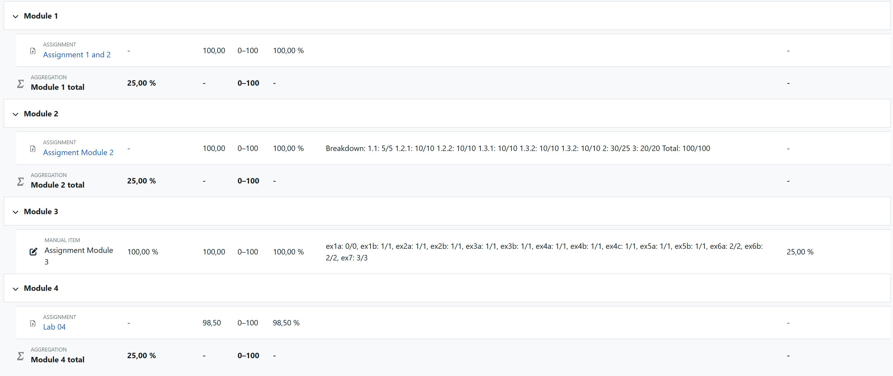

# Information Security Lab

Interfocus lab course at ETH:

* Lab1: Tamarin Prover
* Lab2: Machine Learning Security
* Lab3: Software Security and Side-Channel Attacks

* Lab4: Elliptic Curve Cryptography(ECC) and Lattice Cryptanalysis(copper-smith)

**There may be errors if not full marks gained!**

